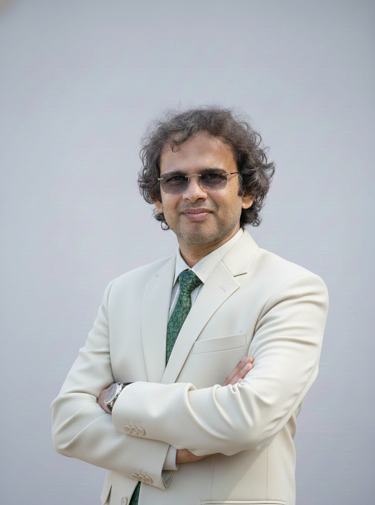

# Prof. Ranjan Mishra

  

**Professor** | *School of Engineering and Technology, Mody University of Science and Technology* | [Google Scholar](https://scholar.google.com/citations?user=ap-S9loAAAAJ&hl=en) 

---

## 👨‍🏫 About Me
Dr. Ranjan Mishra has over 25 years of distinguished experience in teaching, research, and academic administration. He completed his graduation from the University of Burdwan and further enriched his academic career through his association with reputed institutions such as NIST (Odisha), ICFAI University (Dehradun), UPES (Dehradun), and Mody University of Science and Technology (Rajasthan).

Known for his approachable and student-friendly teaching style, Dr. Mishra emphasizes conceptual clarity and practical understanding in the classroom. His dedication to mentoring and academic guidance has endeared him to generations of students.

Dr. Mishra has made significant research contributions, with over 90 publications in reputable journals and conferences and more than 1,000 citations to his work. He has also successfully supervised six Ph.D. scholars, reflecting his strong commitment to research mentorship and academic development.

Currently, he serves as a Professor at Mody University of Science and Technology, Lakshmangarh, a leading Women's university where he continues to contribute actively to its School of Engineering and Technology. Located in Lakshmangarh, Sikar, Rajasthan, the university harmoniously blends India’s rich cultural values with a modern global outlook. It offers a diverse range of academic programs across disciplines such as Engineering, Liberal Arts and Sciences, Management, Pharmacy, Law, and Design, fostering interdisciplinary learning and innovation.

With a strong global outlook, the university has established strategic collaborations with more than 20 international universities, providing students with valuable global exposure, collaborative learning opportunities, and industry-aligned education. Driven by a commitment to excellence, the university continues to move forward by combining state-of-the-art infrastructure, academic rigor, and a vibrant learning ecosystem. Through this holistic approach, it strives to empower and nurture the next generation of women leaders, equipping them with the knowledge, confidence, and skills required to excel in an increasingly competitive global landscape.

## 🔬 Research Interests
* Topic 1 (e.g., Antenna Design)
* Topic 2 (e.g., Frequency Selective Surfaces)
* Topic 3 (e.g., Vehicular Communication)

## 📝 Selected Publications
*Please refer to [Google Scholar](https://scholar.google.com/citations?user=ap-S9loAAAAJ&hl=en) for a complete list of over 90 publications and 1,000+ citations.*

---

## 📚 Current Course Teaching

### A. Computer Networks (CSE 6th Sem.)
* 📄 [Study Material](#)
* 🔬 [Lab Manual](#)
* 📊 [Mid Sem 1 Marks](#)

### B. Basics of Electronics Engineering (CSE 2nd Sem.)
* 📄 [Study Material](#)
* 🔬 [Lab Manual](#)
* 📊 [Mid Sem 1 Marks](#)

---

## 🎓 Proud Ph.D. Supervised Students

1. **Dr. Rajeev Dandotia** – Director NTRO, Govt. of India, New Delhi (2021)
2. **Dr. Ankush Kapoor** – Associate Professor, Govt. Engineering College, Shimla, HP (2022)
3. **Dr. Ankit Garg** – Wing Commander, Indian Air Force (2025)
4. **Dr. Tej Raj** – Assistant Professor, Chitkara University, Punjab (2025)
5. **Ms. Sunaina Singh** – (2026)
6. **Ms. Vartika Dahima** – (2026)

---
*Last updated: March 2026*
